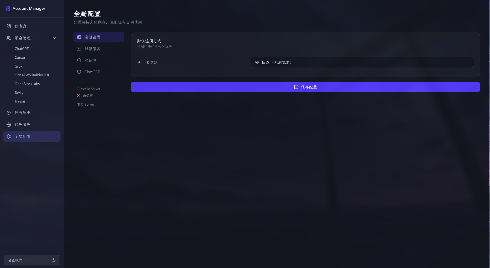
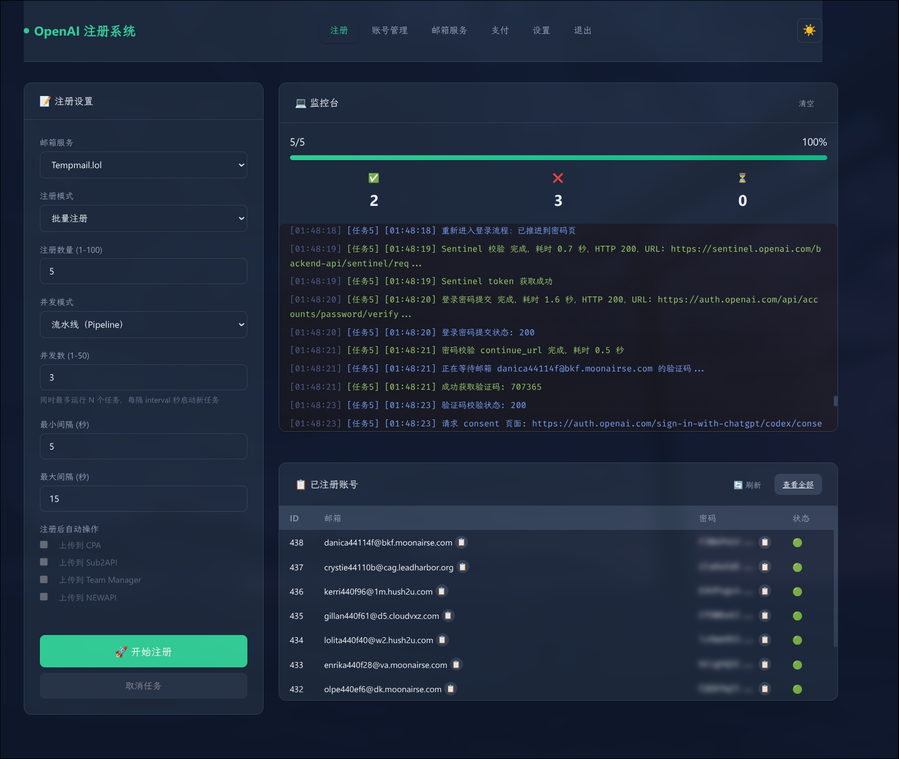

# 项目探索笔记

## AI厂商自动注册机

### [any-auto-register](https://github.com/lxf746/any-auto-register)

- 支持平台：7 个（chatgpt, cursor, grok, kiro, openblocklabs, tavily, trae）



#### 📧 **邮箱服务配置**
已配置 6 种邮箱服务（均未填写凭证）：
- ✅ **TempMail.lol**（无需配置，可直接使用）
- ⚠️ MoeMail - 需配置 API 地址
- ⚠️ DuckMail - 需配置
- ⚠️ Laoudo - 需配置账号 ID + JWT Token
- ⚠️ Cloudflare Worker - 需自建服务
- ⚠️ MailTM - 需配置

#### 🔐 **验证码服务配置**
已配置 3 种验证码服务（均未填写 API Key）：
- ⚠️ YesCaptcha - **需配置 Client Key**
- ⚠️ 2Captcha - **需配置 API Key**
- ⚠️ 本地 Solver (Camoufox) - 需启动 Solver 服务（端口 8889）

#### 平台注册功能测试结果

1. **邮箱服务**：
   - ✅ TempMail.lol 可用且稳定
   - 其他邮箱服务需要额外配置凭证

2. **验证码服务**：
   - ⚠️ **关键问题**：Cursor、Tavily、Grok 需要验证码服务才能注册
   - 需要配置 YesCaptcha 或 2Captcha API Key 才能继续测试这些平台
   - 本地 Solver 未启动（日志显示"[Solver] 启动超时"）

3. **平台特点**：
   - Trae.ai 和 Kiro：协议模式可直接注册，无需验证码
   - Cursor/Tavily/Grok：需要 Turnstile/reCAPTCHA 验证
   - OpenBlockLabs：遇到 Cloudflare 拦截（403）

4. **数据库问题**：
   - 发现日期时间字段序列化兼容性问题（已在运行时观察到）
   - 历史任务中有 UNIQUE 约束冲突错误

### [codex-register](https://github.com/cnlimiter/codex-register)



```bash
python webui.py --host 0.0.0.0 --port 8080 --debug
```

项目原生配置很方便，直接使用TempMail.lol邮箱服务，无须配置。最开始我在X上看到本项目，便立刻动手部署，第一天就注册了300多个账号放进了号池。结果没过两天，该项目就被OpenAI针对，项目README直接一级标题说明：`# 官方拉闸了,改变了授权流程,各位自行研究吧 `，体现在使用时报错：`授权 Cookie 里没有 workspace 信息`。

```shell
INFO: 127.0.0.1:36736 - "GET /api/accounts?page=1&page_size=10 HTTP/1.1" 200 OK
登录流程验证码校验失败
授权 Cookie 里没有 workspace 信息
注册任务失败: a9fe45bc-89c1-494a-b988-3b407435d151, 原因: 获取 Workspace ID 失败
INFO: 127.0.0.1:44842 - "GET /api/accounts?page=1&page_size=10 HTTP/1.1" 200 OK
consent 页面缺少 workspace_id，回退到 Cookie 解析路径
INFO: 127.0.0.1:55154 - "GET /api/accounts?page=1&page_size=10 HTTP/1.1" 200 OK
INFO: 192.168.1.3:38674 - "HEAD / HTTP/1.0" 405 Method Not Allowed
INFO: 192.168.1.3:38686 - "GET / HTTP/1.1" 302 Found
INFO: 192.168.1.3:38686 - "GET /login?next=/ HTTP/1.1" 200 OK
INFO: 127.0.0.1:58630 - "GET /api/accounts?page=1&page_size=10 HTTP/1.1" 200 OK
```

我本打算使用AI修改项目代码来适配新的授权流程，但遇到了种种问题：

1. TempMail.lol邮箱服务有时经常报错429，即使我请求的并不是很快。于是我去dynadot注册了一个域名`chesszyh.xyz`，并转移域名到Cloudflare，然后让claude-code帮我自建了[Cloudflare-Temp](https://github.com/dreamhunter2333/cloudflare_temp_email)邮箱。(cc可以执行`wrangler`等命令行工具部署Cloudflare Workers，部署后会得到一个Worker地址，用户可以通过这个地址来获取临时邮箱服务。)

```ini
url=<mail-domain>
worker-address=<cloudflare-worker-url>
admin-token=<redacted-admin-token>
```

接着，我让AI阅读[文档](https://temp-mail-docs.awsl.uk/zh/)，帮我接入Cloudflare-Temp邮箱服务。成功了。

但是，后续还有其他问题。

2. 并发数似乎有上限：即使写了10,甚至20/50等更高的并发，但是实际执行起来还是很慢。这个问题一直没解决，可能是网络连接库底层的一些限制。

3. 验证码错误率高（80%）：OpenAI 返回 "Wrong code"，说明从邮箱提取的验证码不正确。Claude sonnet 4.6分析可能是Freemail/Tempmail 服务没有正确使用 otp_sent_at 参数，导致可能提取到旧邮件中的验证码。一个简单的邮件验证码提取，需要做的步骤还挺多的：

- 记录 OTP 发送时间
- 显示获取到的邮件数量
- 标记哪些邮件被跳过（旧邮件）
- 显示每封OpenAI 邮件的发件人和主题
- 区分从哪个字段找到验证码（预览/详情/verification_code）

......

4. 在创建`dev`分支后修改代码改的如火如荼时，我发现上游仓库更新了，所以我就`git switch main`拉取了最新的代码，发现更改不少。改后的代码，TemMail.lol邮箱服务似乎不怎么429了，但是注册出现了新的报错：

```json
{
  "error": {
    "message": "Sorry, we cannot create your account with the given information.",
    "type": "invalid_request_error",
    "param": null,
    "code": "registration_disallowed"
  }
}
```

这实在是很难搞了。

改到现在，我也是得出了一个观点：

**这种针对特定平台的自动注册工具，维护成本非常高，尤其是当平台方不断更新反制措施时。除非有非常强大的技术能力和持续的投入，否则很难长期保持工具的有效性。**

作为代码小白，我即使有AI的帮助，也很难将一个自动注册机项目跑到能实际生产应用的程度。而我自己费劲巴拉搞半天跑起来，最多是能帮我薅一点羊毛，而且上游更新可能很快，马上就会覆盖掉我的更新（相当于我在做无用功，我又没能力提PR）。批量注册的账号还很有可能在按小时记的单位里被封禁掉。不如老老实实花点钱买个ChatGPT Plus账号，或者加入Teams/购买Teams母号算了。

**减少在这类项目上的时间投入，转而关注一些更有意义的项目，或者学习一些更基础的编程技能，可能会更有收获。**

（并且，很多这类项目应该都是vibe-coding出来的，代码质量堪忧。追随这些项目的脚步，就像疯狂追随OpenClaw一样可笑和无用）

### [Codex-Manager](https://github.com/qxcnm/Codex-Manager/)

这个项目虽然也是vibe的，但是使用起来感觉还不错。我用这个项目起docker容器然后管理400多个codex账号，负载均衡反代到`http://localhost:48761/v1`，可以给`babeldoc`使用。

### [RegPlatformManager](https://github.com/xiaolajiaoyyds/regplatformm)

也是支持OpenAI / Grok / Kiro / Gemini 等平台的全自动注册、OAuth Token 获取、积分系统与多用户管理。

作者说：

> 部署比较复杂，不可直接食用，需要进行配置你们自己的仓库以及 hf账号密钥，以及git仓库密钥，以及 cf 的密钥～ 在就是其他的参数配置～ 建议喂给 ai 进行适配～ 小白不建议玩耍哦～

他说得对。上面3个项目部署起来还是很方便的，README里也写得很清楚，基本上按照步骤来就行了。这个项目连部署都需要自己探索，那其实更没必要看了。

**我不缺乏部署项目的能力，而且现在这个AI Agent时代，很多项目只需要一句话就能部署完了。我缺乏的是从头创新和理解项目的能力。**
